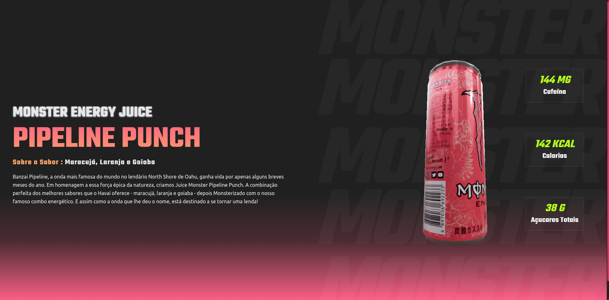

# 🥤 Monster Energy - Pipeline Punch 3D



Uma landing page imersiva e de alta performance desenvolvida para proporcionar uma experiência visual interativa em torno do energético **Monster Pipeline Punch**. O projeto utiliza tecnologias de ponta em renderização 3D web para criar uma vitrine digital realista.

---

## 📝 O Desafio das 10 Horas

Este projeto foi o resultado de um **desafio pessoal de Carnaval**: realizar o redesign completo e a implementação técnica desta página em apenas **10 horas**, partindo do zero. 

Eu detalhei todo o processo de decisão, as escolhas da stack e como superei os desafios de performance (como a gestão de memória da GPU e o comportamento do scroll no mobile) em um post no LinkedIn.

**Quer saber mais sobre os bastidores desse sprint?** 👉 [**Confira o post completo no LinkedIn e deixe seu feedback!**]( https://www.linkedin.com/posts/victor-kiss_nextjs-threejs-webgraphics-activity-7429250043427274752-nHzz?utm_source=share&utm_medium=member_ios&rcm=ACoAAC4CIrIBVP9FiboYaZB6dpYNGQ8ys_5hoUA) *(Substitua este link pelo link do seu post quando publicar)*

---

## ✨ Destaques do Projeto

* **Experiência 3D Interativa:** Modelo 3D da lata de Monster com materiais metálicos realistas, reflexos de ambiente e interatividade fluida.
* **Performance Otimizada:** Uso de compressão **Draco** e `gltfjsx --transform` para garantir carregamento ultra-rápido do modelo.
* **Scroll Amigável:** Implementação de `PresentationControls` que permite girar o produto sem interferir na rolagem vertical em dispositivos móveis.
* **UI Dinâmica:** Animações de interface e backgrounds flutuantes desenvolvidos com Framer Motion.
* **Responsividade:** Design adaptável que mantém a imersão tanto em desktops quanto em smartphones.

## 🛠️ Tecnologias Utilizadas

* **[Next.js 15](https://nextjs.org/):** Framework React para aplicações web de alto desempenho.
* **[React Three Fiber](https://r3f.docs.pmnd.rs/):** Renderer Three.js focado em componentes React.
* **[React Three Drei](https://github.com/pmndrs/drei):** Coleção de utilitários auxiliares para Three.js.
* **[Tailwind CSS](https://tailwindcss.com/):** Estilização baseada em utilitários para design ágil.
* **[Framer Motion](https://www.framer.com/motion/):** Biblioteca para animações complexas e gestos.

## 🚀 Desafios Técnicos Superados

1. **Otimização WebGL:** Ajuste de `DPR` (Device Pixel Ratio) para evitar sobrecarga de GPU em telas de alta densidade (Retina).
2. **Gestão de Contexto:** Prevenção do erro `Context Lost` através do gerenciamento eficiente de memória e recursos do navegador.
3. **HMR & Dev Server:** Configuração de `allowedDevOrigins` para permitir testes em tempo real via rede local em dispositivos móveis.

## 📦 Instalação e Execução

Para rodar este projeto localmente, siga os passos abaixo:

1. Clone o repositório:
```bash
git clone https://github.com/victor-kiss/monster-pipeline-punch-3d.git

```


2. Instale as dependências:
```bash
npm install

```


3. Execute o servidor de desenvolvimento:
```bash
npm run dev

```


4. Acesse `http://localhost:3000` no seu navegador.

---

## 📄 Licença

Este projeto é apenas para fins de portfólio e estudo. A marca **Monster Energy** e o design do produto pertencem à [Monster Energy Company](https://www.monsterenergy.com/).

Desenvolvido com ⚡ por [Victor Kiss](https://www.google.com/search?q=https://github.com/victor-kiss)
