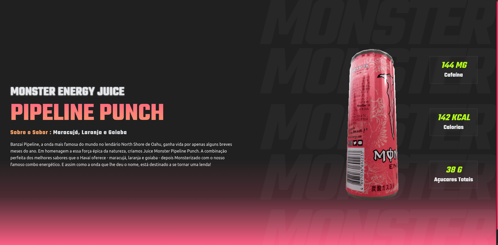

# 🥤 Monster Energy - Pipeline Punch 3D




  
**Engenharia Front-end Avançada: Unindo renderização WebGL de alta performance com interfaces imersivas no ecossistema Next.js.**

[-000000?style=for-the-badge&logo=nextdotjs&logoColor=white)](https://nextjs.org/)
[](https://r3f.docs.pmnd.rs/)
[](https://www.typescriptlang.org/)
[](https://www.framer.com/motion/)


---

## 📖 Visão Arquitetural

O **Monster Pipeline Punch 3D** não é apenas uma landing page; é uma prova de conceito focada na integração fluida entre o **DOM tradicional** e o **Canvas WebGL**. O projeto explora os limites da renderização em tempo real no navegador, utilizando o ecossistema React para orquestrar gráficos 3D fotorrealistas sem comprometer as métricas do Core Web Vitals (LCP, FID, CLS).

Construído sob a pressão de um **sprint de 10 horas**, este repositório demonstra a capacidade de tomar decisões arquiteturais rápidas voltadas para performance, gestão de memória e UX mobile-first em cenários 3D complexos.

## 🚀 Tecnologias e Paradigmas

O stack foi selecionado para garantir a melhor sinergia entre ferramentas de ponta:

* **Core:** Next.js 15 operando com o paradigma de Server Components e Client Components (para hidratação do Canvas).
* **WebGL Pipeline:** React Three Fiber (R3F) para construção declarativa da cena, acoplado à biblioteca `drei` para abstração de controles complexos de câmera e ambiente.
* **State & Animation Sync:** Framer Motion guiando o DOM, sincronizado indiretamente com as interações de drag e rotação do modelo 3D.
* **Styling:** Tailwind CSS para uma arquitetura CSS utility-first, garantindo baixo overhead no bundle final.

---

## ⚡ Engenharia de Performance & WebGL Otimizado

Trabalhar com 3D no client-side exige um controle rigoroso sobre a GPU e o Main Thread. As seguintes estratégias nível sênior foram implementadas:

### 1. Otimização Agressiva de Geometria e Texturas
Modelos 3D crus (GLTF/GLB) são pesados e bloqueiam a thread de renderização. Para resolver isso:
* **Compressão Draco:** Utilizada para reduzir drasticamente o tamanho do buffer de geometria (payload reduction), acelerando o *Time to Interactive* (TTI).
* **Transformação Offline:** Aplicação do `gltfjsx --transform` no pipeline de build para otimizar a estrutura do grafo de cena (Scene Graph), unindo meshes (instancing) e descartando nós invisíveis.

### 2. Gestão de Memória e Resolução Dinâmica (DPR)
O gargalo mais comum em WebGL mobile é o *fill rate* da GPU e a memória de vídeo (VRAM).
* **DPR Clamping:** Implementação de um teto de escala de resolução (`dpr={[1, 1.5]}`) em vez do padrão `window.devicePixelRatio`. Isso previne que telas Retina de smartphones tentem renderizar o Canvas em resoluções absurdas (como 3x ou 4x), o que causaria thermal throttling, queda vertiginosa de FPS e drenagem de bateria.
* **Prevenção de `Context Lost`:** Gerenciamento meticuloso do ciclo de vida dos materiais e texturas (dispose manual ou via hooks do R3F) para evitar o crash da API WebGL por falta de memória em sessões longas.

### 3. Resolução de Conflitos de Eventos (Scroll vs. Orbit)
O maior desafio de UX em interfaces "scroll-telling" com 3D:
* **PresentationControls vs. OrbitControls:** Em vez do tradicional Orbit, que "sequestra" eventos de toque (TouchEvents) impossibilitando o scroll vertical no mobile, foi utilizado o `PresentationControls`. Ele permite a rotação (yaw/pitch) da malha do produto com retorno elástico (spring physics), mantendo o fluxo natural do DOM perfeitamente intacto.

---

## 🧩 Estrutura de Diretórios Inferida

A separação de responsabilidades (SoC) é vital para escalar projetos híbridos (DOM + Canvas):

```text
📦 monster-pipeline-punch-3d
├── 📂 app/
│   ├── 📂 components/
│   │   ├── 📂 canvas/        # Componentes R3F (Modelos, Luzes, Câmera, Environment)
│   │   │   ├── MonsterCan.tsx
│   │   │   └── Scene.tsx
│   │   ├── 📂 dom/           # Componentes React tradicionais (HTML/Framer Motion)
│   │   │   ├── HeroInfo.tsx
│   │   │   └── OverlayUI.tsx
│   ├── 📜 layout.tsx         # Next.js Root Layout (Server-side)
│   └── 📜 page.tsx           # Ponto de injeção unindo Canvas e DOM
├── 📂 public/
│   ├── 📂 models/            # Arquivos .glb comprimidos (Draco)
│   └── 📂 textures/          # Mapas HDRI ou texturas PBR auxiliares
├── 📜 tailwind.config.ts     # Design system (Tipografia, Cores Monster)
└── 📜 next.config.ts         # Configurações de transpile e devOrigins
````

-----

## ⚙️ Workflow de Desenvolvimento

### Requisitos do Sistema

  * Node.js (v18.17.0+)
  * Navegador com suporte moderno a WebGL 2.0.

### Setup Rápido

1.  **Clonagem e Instalação:**

    ```bash
    git clone [https://github.com/victor-kiss/monster-pipeline-punch-3d.git](https://github.com/victor-kiss/monster-pipeline-punch-3d.git)
    cd monster-pipeline-punch-3d
    npm install
    ```

2.  **Iniciando o Dev Server:**

    ```bash
    npm run dev
    ```

    > **Dica de Debug Mobile:** Para testar a performance do WebGL diretamente no seu smartphone durante o desenvolvimento local, o Next.js está configurado com `allowedDevOrigins`. Conecte o dispositivo na mesma rede Wi-Fi e acesse o IP local exposto no terminal.

-----

## ⚖️ Disclaimer Legal e Propriedade Intelectual

Este projeto tem fins estritamente **educacionais e de demonstração de proficiência técnica (portfólio)**.
Não possui nenhum vínculo comercial, patrocínio ou afiliação com a **Monster Energy Company**. Todo o design gráfico das embalagens, marcas registradas e logotipos são propriedades exclusivas de seus respectivos donos.

-----

## 👨‍💻 O Arquiteto por Trás do Código

**Victor Kiss**
Desenvolvedor Front-end com foco em UI/UX e Criação de Experiências Digitais.

[Linkedin](https://www.google.com/search?q=https://www.linkedin.com/in/victor-kiss/)
[GitHub](https://www.google.com/search?q=https://github.com/victor-kiss)
